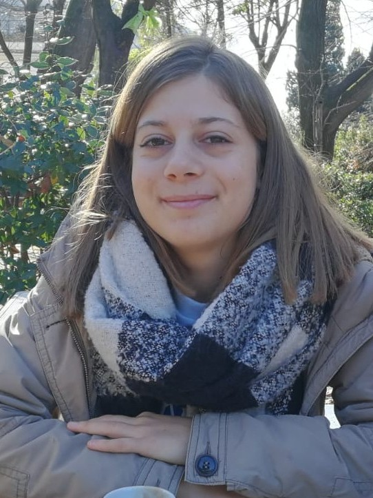

## Introduction
I am a PhD student at the University of Copenhagen and University of Leuven. The goal of my project is to study the impact of irradiation and stellar variability in the chemical and physical structure of the exoplanet’s atmosphere. I will work on the self-consistent inclusion of irradiation in the stellar code [MARCS code](https://ui.adsabs.harvard.edu/abs/2008A%26A...486..951G/abstract).
 
###  Education
   - 2013 - 2017 : Bachelor in Physics at _La Sapienza University_, Rome, Italy.
                    _Thesis_ : "Direct imaging to detect exoplanets"
   - 2017 - 2019 : Master in Astronomy and Astrophysics at _La Sapienza University_, Rome, Italy.
                    _Thesis_ : "Study of the impact of stellar activity on spectroscopic measurements of transiting exoplanets"
   - 2020 - now : MC-ITN CHAMELEON PhD fellow at _Niels Bohr Institute_, Astrophysics and Planetary Science, _University of Copenaghen_. 
                  _Project title_ : "Irradiation and impact of stellar variability on exoplanetary atmospheres"
   
### Previous work
   - Apr 2019 - Jan 2020 : I worked on my master thesis project at Institute of Space Sciences (IEEC-CSIC), Barcelona, Spain

### Contact
   - _address_ : Gothersgade 130, 1123 København K
   - _email_ : flavia.amadio@nbi.ku.dk
   


[Link](url) and 
```

